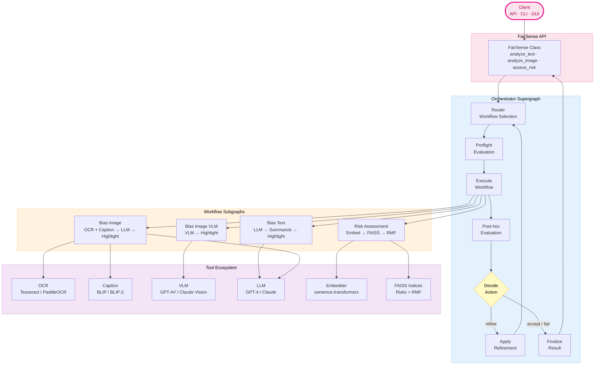
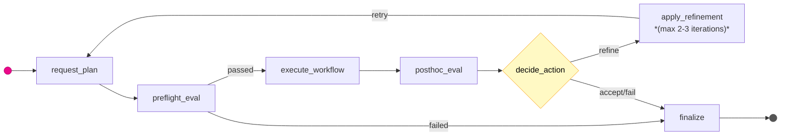
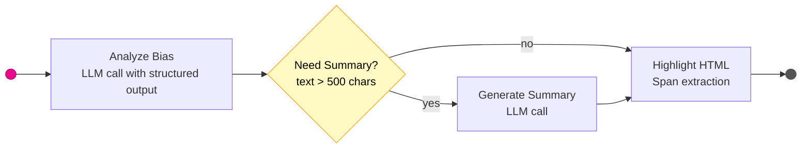
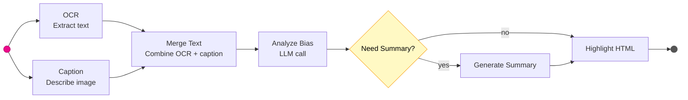
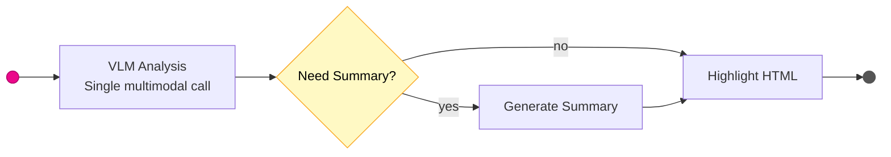
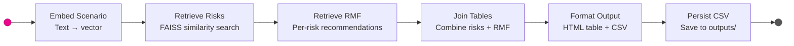
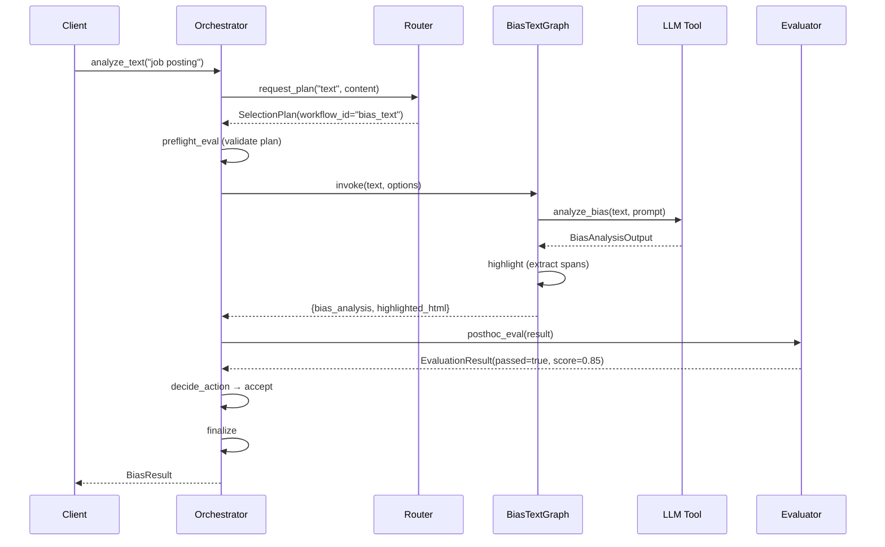
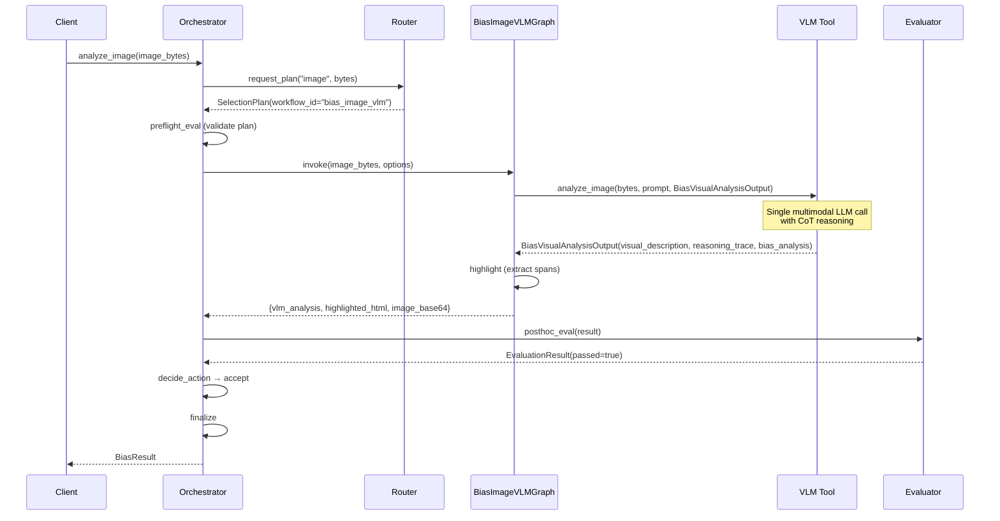
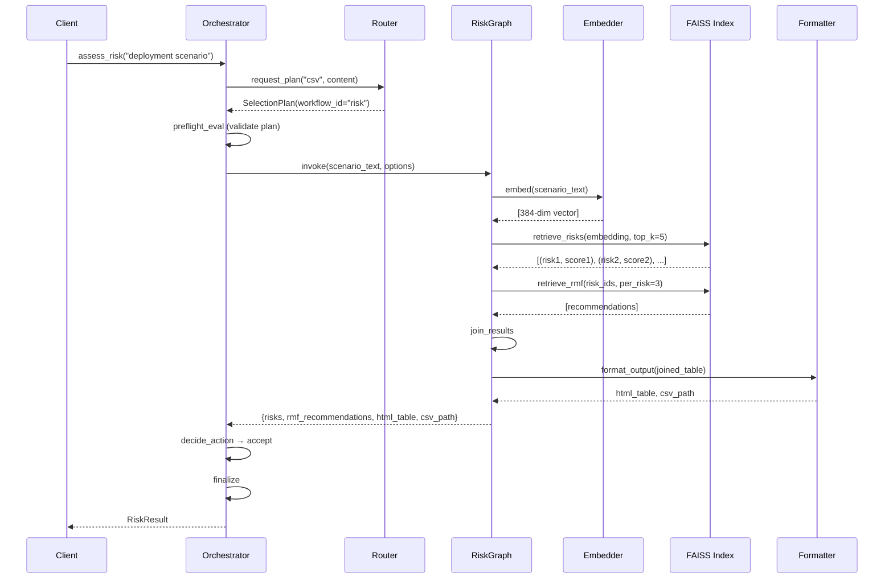

# Architecture

This page documents the system architecture of FairSense-AgentiX, including the agentic workflow, component design, and technology stack.

---

## System Overview

FairSense-AgentiX is built on an **agentic architecture** that uses a ReAct (Reasoning + Acting) pattern to intelligently analyze content for bias and AI risks. Unlike traditional ML pipelines, the system dynamically selects tools, evaluates outputs, and refines results through an iterative feedback loop.



### Key Design Principles

1. **Agentic Decision-Making** - The orchestrator autonomously selects workflows, evaluates quality, and refines outputs
2. **Tool Abstraction** - Swappable tool implementations (Tesseract ↔ PaddleOCR, GPT-4 ↔ Claude) via dependency injection
3. **Quality-Driven Refinement** - Evaluator-critic pattern enables iterative improvement until quality thresholds are met
4. **Observable by Design** - Full telemetry streaming via WebSocket for real-time visibility into agent reasoning
5. **Configuration Over Code** - Environment variables control all tool selection, model parameters, and refinement behavior

---

## Component Breakdown

### 1. Client Entry Points

**Purpose:** Provide multiple interfaces for accessing FairSense functionality

**Components:**
- **Python API** (`fairsense_agentix.api.FairSense`) - Main programmatic interface
- **REST API** (`fairsense_agentix.service_api.server`) - FastAPI HTTP endpoints
- **CLI** (planned) - Command-line interface
- **React UI** (`ui/`) - Web-based graphical interface

**Responsibilities:**
- Accept user input (text, images, deployment scenarios)
- Normalize input format
- Invoke orchestrator graph
- Return structured results

---

### 2. Orchestrator Supergraph

**Purpose:** Coordinate the entire analysis workflow using an agentic ReAct loop

**Location:** `fairsense_agentix/graphs/orchestrator_graph.py`

**Architecture:** LangGraph state machine with 7 nodes and conditional edges

#### Nodes

| Node | Purpose | Output |
|------|---------|--------|
| `request_plan` | Calls router to select workflow and configure parameters | `SelectionPlan` |
| `preflight_eval` | Pre-flight validation (future: check resources, API keys) | `EvaluationResult` |
| `execute_workflow` | Delegates to appropriate subgraph (bias_text, risk, etc.) | `workflow_result` dict |
| `posthoc_eval` | Quality assessment via evaluator service | `EvaluationResult` |
| `decide_action` | Determine next action (accept, refine, fail) | `decision` string |
| `apply_refinement` | Update plan with evaluator feedback | Updated `SelectionPlan` |
| `finalize` | Package final result for client | `final_result` dict |

#### State Flow



**Key Features:**
- **ReAct Pattern:** Router reasons about input → Executor acts → Evaluator observes → Decision reflects
- **Refinement Loop:** Iterative quality improvement (disabled by default in Phase 2-6, enabled in Phase 7+)
- **Telemetry Integration:** Every node emits telemetry events for observability
- **Error Handling:** Graceful degradation with error accumulation in state

---

### 3. Router Service

**Purpose:** Analyze input and create an execution plan

**Location:** `fairsense_agentix/services/router.py`

**Responsibilities:**
- Determine which workflow to run (`bias_text`, `bias_image`, `bias_image_vlm`, `risk`)
- Select tool implementations (LLM model, OCR method, VLM vs traditional)
- Configure workflow parameters (temperature, top_k, summarization rules)
- Provide confidence score and reasoning for decision

**Output:** `SelectionPlan` with:
- `workflow_id` - Which subgraph to execute
- `reasoning` - Human-readable explanation
- `confidence` - Routing confidence (0.0-1.0)
- `tool_preferences` - Tool selection hints
- `node_params` - Per-node configuration

**Routing Logic (Phase 2-6):**

| Input Type | Workflow | Conditions |
|------------|----------|------------|
| `text` | `bias_text` | Always (deterministic) |
| `image` | `bias_image_vlm` | If `settings.image_analysis_mode == "vlm"` and provider supports VLM |
| `image` | `bias_image` | If `settings.image_analysis_mode == "traditional"` or no VLM support |
| `csv` | `risk` | Always (deterministic) |

**Future Enhancement (Phase 7+):**
- LLM-based routing for ambiguous inputs
- Content analysis for hybrid workflows
- Fallback cascade (primary → secondary → tertiary)

---

### 4. Workflow Subgraphs

**Purpose:** Execute specialized analysis pipelines

**Location:** `fairsense_agentix/graphs/`

#### 4.1 Bias Text Workflow

**File:** `bias_text_graph.py`

**Flow:**


**Nodes:**
1. **analyze_bias** - Calls LLM with bias detection prompt, returns structured `BiasAnalysisOutput`
2. **summarize** (conditional) - Generates executive summary if text is long
3. **highlight** - Converts bias instances to color-coded HTML

**Output Fields:**
- `bias_analysis` - Structured Pydantic model with bias instances
- `summary` - Optional executive summary
- `highlighted_html` - HTML with `<span class="bias-{type}">` tags

---

#### 4.2 Bias Image Workflow (Traditional)

**File:** `bias_image_graph.py`

**Flow:**


**Nodes:**
1. **ocr** - Extracts text from image using Tesseract or PaddleOCR
2. **caption** - Generates image description using BLIP or BLIP-2
3. **merge_text** - Combines OCR and caption into unified text
4. **analyze_bias** - Same as bias_text workflow
5. **summarize** (conditional) - Optional summary
6. **highlight** - Color-coded HTML

**Output Fields:**
- `ocr_text` - Extracted text from image
- `caption_text` - Generated image caption
- `merged_text` - Combined text (OCR + caption)
- `bias_analysis` - Structured bias analysis
- `summary` - Optional summary
- `highlighted_html` - HTML highlighting

**Performance:** Slower than VLM workflow (~10-20s) but works with any LLM provider

---

#### 4.3 Bias Image VLM Workflow

**File:** `bias_image_vlm_graph.py`

**Flow:**


**Nodes:**
1. **vlm_analyze** - Single multimodal LLM call (GPT-4V or Claude Vision) with Chain-of-Thought reasoning
2. **summarize** (conditional) - Optional summary
3. **highlight** - Color-coded HTML

**Output Fields:**
- `vlm_analysis` - Structured VLM analysis with:
  - `visual_description` - What the model sees in the image
  - `reasoning_trace` - Chain-of-Thought reasoning steps
  - `bias_analysis` - Bias detection results
- `image_base64` - Base64-encoded image with data URL for UI
- `summary` - Optional summary
- `highlighted_html` - HTML highlighting

**Performance:** Faster than traditional workflow (~5-10s), single API call

**Requirements:** OpenAI or Anthropic provider (VLM support required)

---

#### 4.4 Risk Assessment Workflow

**File:** `risk_graph.py`

**Flow:**


**Nodes:**
1. **embed_scenario** - Converts deployment scenario to 384-dim vector using sentence-transformers
2. **retrieve_risks** - Semantic search against 280+ AI risks from NIST AI-RMF
3. **retrieve_rmf** - For each risk, fetch top-k mitigation recommendations
4. **join_results** - Combines risks with recommendations
5. **format_output** - Creates HTML table for display
6. **persist_csv** - Exports results to `outputs/risk_assessment_{timestamp}.csv`

**Output Fields:**
- `embedding` - 384-dimensional vector of scenario
- `risks` - Top-k AI risks with similarity scores
- `rmf_recommendations` - Mitigation strategies per risk
- `html_table` - Formatted HTML table
- `csv_path` - Path to exported CSV file

**Knowledge Base:**
- **Risks:** 280+ AI risks from NIST AI Risk Management Framework
- **RMF:** 500+ mitigation recommendations mapped to risk categories
- **Storage:** FAISS index files live inside the package at `fairsense_agentix/data/indexes/` in LangChain format:
  ```
  fairsense_agentix/data/indexes/
  ├── risks/index.faiss   # vector index (1,340 risks, 384-dim embeddings)
  ├── risks/index.pkl     # LangChain document store
  ├── risks_meta.json     # human-readable fields (id, risk_name, description, severity, category)
  ├── rmf/index.faiss
  ├── rmf/index.pkl
  └── rmf_meta.json
  ```
  The `FAIRSENSE_FAISS_RISKS_INDEX_PATH` env var uses a virtual `.faiss` path (e.g. `fairsense_agentix/data/indexes/risks.faiss`) — the resolver strips the extension and looks for the `risks/index.faiss` folder structure. If that folder is missing, the system silently falls back to `FakeFAISSIndexTool` which returns hardcoded placeholder results.

---

### 5. Tool Ecosystem

**Purpose:** Provide reusable, swappable implementations of core ML/AI capabilities

**Location:** `fairsense_agentix/tools/`

**Architecture:** Interface-based design with factory pattern via ToolRegistry

#### Tool Registry

**File:** `tools/registry.py`

**Purpose:** Dependency injection container that constructs all tool instances based on configuration

**Pattern:**
```python
@dataclass
class ToolRegistry:
    ocr: OCRTool
    caption: CaptionTool
    llm: LLMTool
    summarizer: SummarizerTool
    embedder: EmbedderTool
    faiss_risks: FAISSIndexTool
    faiss_rmf: FAISSIndexTool
    formatter: FormatterTool
    persistence: PersistenceTool
    vlm: VLMTool

registry = create_tool_registry(settings)
# All tools now available via registry.ocr, registry.llm, etc.
```

**Benefits:**
- **Single Source of Truth:** One place constructs all tools
- **Configuration-Driven:** Settings determine which implementations are used
- **Testability:** Easy to inject fake tools for testing
- **Swappability:** Change implementations without modifying workflow code

---

#### Tool Implementations

| Tool | Interface | Implementations | Purpose |
|------|-----------|-----------------|---------|
| **OCR** | `OCRTool` | Tesseract, PaddleOCR, Fake | Extract text from images |
| **Caption** | `CaptionTool` | BLIP, BLIP-2, Fake | Generate image descriptions |
| **VLM** | `VLMTool` | GPT-4V, Claude Vision, Fake | Multimodal reasoning with CoT |
| **LLM** | `LLMTool` | GPT-4, Claude, Local (Ollama), Fake | Text generation and analysis |
| **Embedder** | `EmbedderTool` | sentence-transformers, OpenAI, Fake | Text → vector embeddings |
| **FAISS Index** | `FAISSIndexTool` | FAISS (CPU/GPU) | Semantic search over knowledge bases |
| **Formatter** | `FormatterTool` | HTML/CSV formatter | Output formatting |
| **Persistence** | `PersistenceTool` | File I/O | Save results to disk |
| **Summarizer** | `SummarizerTool` | LLM-based | Generate executive summaries |

---

#### Tool Selection Logic

**Auto-Detection:**
- **OCR:** `settings.ocr_tool = "auto"` → PaddleOCR (GPU) or Tesseract (CPU)
- **Caption:** `settings.caption_model = "auto"` → BLIP-2 (better) or BLIP (fallback)
- **Embedder:** `settings.embedding_provider = "auto"` → sentence-transformers (local, free) or OpenAI (API)

**Manual Override:**
```python
# Force specific implementations
os.environ["FAIRSENSE_OCR_TOOL"] = "tesseract"
os.environ["FAIRSENSE_CAPTION_MODEL"] = "blip2"
os.environ["FAIRSENSE_LLM_PROVIDER"] = "anthropic"
os.environ["FAIRSENSE_LLM_MODEL_NAME"] = "claude-3-5-sonnet-20241022"
```

**Testing Mode:**
```python
# Use fake tools for fast deterministic testing
os.environ["FAIRSENSE_LLM_PROVIDER"] = "fake"
os.environ["FAIRSENSE_OCR_TOOL"] = "fake"
os.environ["FAIRSENSE_CAPTION_MODEL"] = "fake"
```

---

### 6. Evaluator Service

**Purpose:** Post-hoc quality assessment and refinement guidance

**Location:** `fairsense_agentix/services/evaluator.py`

**Components:**

#### 6.1 Bias Evaluator (LLM-Based)

**Purpose:** Critique bias analysis output for completeness and accuracy

**Method:** Single-shot LLM call with structured output

**Evaluation Criteria:**
- **Completeness:** Did the analysis cover all bias categories (gender, age, race, etc.)?
- **Accuracy:** Are bias spans correctly identified and grounded in source text?
- **Actionability:** Are explanations clear and useful?

**Output:**
```python
class BiasEvaluatorOutput(BaseModel):
    score: int  # 0-100
    justification: str  # Why this score
    suggested_changes: list[str]  # Concrete refinement actions
```

**Refinement Triggers:**
- If `score < settings.bias_evaluator_min_score` (default: 75)
- Suggested changes are injected into `options["bias_prompt_feedback"]`
- Orchestrator loops back to `request_plan` with updated guidance

---

#### 6.2 Risk Evaluator (Rule-Based)

**Purpose:** Statistical quality checks for risk assessment output

**Method:** Rule-based validation (no LLM calls)

**Evaluation Criteria:**
- **Diversity:** Are top risks from diverse categories?
- **Coverage:** Sufficient number of RMF recommendations per risk?
- **No Duplicates:** Risk names and descriptions are unique?

**Output:**
```python
class RiskEvaluatorOutput(BaseModel):
    score: int  # 0-100
    justification: str
    issues: list[str]
    suggested_changes: dict[str, Any]  # e.g., {"top_k": 10}
    metadata: dict[str, Any]  # Diagnostics
```

**Refinement Hints:**
- Increase `top_k` if diversity is low
- Adjust `rmf_per_risk` if coverage is insufficient

---

### 7. Telemetry System

**Purpose:** Observable agent reasoning and performance tracking

**Location:** `fairsense_agentix/services/telemetry.py`

**Features:**
- **Event Streaming:** All workflow transitions, tool calls, and LLM calls emit structured events
- **WebSocket Integration:** Real-time events pushed to UI via `/v1/stream/{run_id}`
- **Performance Tracking:** Timers for every operation (node execution, tool calls, LLM calls)
- **Context Propagation:** `run_id` tracks execution across all components

**Event Types:**

| Event | Triggered By | Context Fields |
|-------|--------------|----------------|
| `workflow_start` | Analysis begins | `input_type`, `workflow_id` |
| `phase_transition` | Node execution | `from_phase`, `to_phase`, `phase_number` |
| `tool_call_start` | Tool invocation | `tool_name`, `inputs` |
| `tool_call_end` | Tool completes | `tool_name`, `outputs`, `duration_ms` |
| `llm_call_start` | LLM request | `model`, `temperature`, `max_tokens` |
| `llm_call_end` | LLM response | `model`, `tokens_used`, `duration_ms` |
| `refinement_start` | Refinement iteration begins | `iteration_number`, `reason` |
| `analysis_complete` | Workflow finishes | `result` (full output) |
| `analysis_error` | Workflow fails | `error_type`, `error_message` |

**WebSocket Example:**
```python
import websockets

async with websockets.connect(f"ws://localhost:8000/v1/stream/{run_id}") as ws:
    async for message in ws:
        event = json.loads(message)
        print(f"[{event['event']}] {event['context'].get('message', '')}")
```

---

### 8. Service API Layer

**Purpose:** Production-ready HTTP interface for remote analysis

**Location:** `fairsense_agentix/service_api/server.py`

**Technology:** FastAPI with async/await support

**Components:**

#### REST Endpoints

| Endpoint | Method | Purpose |
|----------|--------|---------|
| `/v1/health` | GET | Health check |
| `/v1/analyze` | POST | Synchronous analysis (JSON payload) |
| `/v1/analyze/upload` | POST | File upload analysis (multipart) |
| `/v1/analyze/start` | POST | Async analysis (returns run_id immediately) |
| `/v1/analyze/upload/start` | POST | Async file upload |
| `/v1/batch` | POST | Batch job submission |
| `/v1/batch/{job_id}` | GET | Poll batch status |
| `/v1/shutdown` | POST | Graceful server shutdown |

#### WebSocket Protocol

**Endpoint:** `ws://localhost:8000/v1/stream/{run_id}`

**Purpose:** Real-time telemetry streaming

**Lifecycle:**
1. Client calls `/v1/analyze/start` → receives `run_id`
2. Client connects to `/v1/stream/{run_id}` immediately
3. Backend runs analysis in background, emits events to WebSocket
4. WebSocket closes after `analysis_complete` or `analysis_error`

**Event Format:**
```json
{
  "run_id": "abc123...",
  "timestamp": 1234567890.123,
  "event": "tool_call_start",
  "level": "info",
  "context": {
    "message": "Running OCR on image",
    "tool_name": "ocr",
    "inputs": "..."
  }
}
```

---

### 9. Frontend UI

**Purpose:** User-friendly web interface for FairSense

**Location:** `ui/`

**Technology:** React 18 + Vite + TypeScript

**Components:**

#### Key Features
1. **Unified Input Panel** - Text field or drag-and-drop image upload
2. **Mode Selector** - Bias (Text), Bias (Image), Risk
3. **Live Timeline** - Real-time agent telemetry visualization
4. **Results Panel** - Structured output with:
   - Bias instances with severity badges
   - Highlighted text with color coding
   - Risk tables with RMF recommendations
5. **Batch Jobs** - Process multiple items with progress tracking
6. **Shutdown Button** - Gracefully stop backend

#### WebSocket Integration
- Connects to `/v1/stream/{run_id}` on analysis start
- Renders timeline events in real-time
- Shows agent reasoning steps (phase transitions, tool calls, LLM calls)
- Displays progress indicators

---

## Data Flow

### Text Bias Analysis Flow



### Image Bias Analysis Flow (VLM Mode)



### Risk Assessment Flow



---

## Technology Stack

### Core Framework
- **LangGraph** (0.2+) - State graph orchestration for agentic workflows
- **LangChain** (0.3+) - LLM abstractions, tool interfaces, callbacks
- **Pydantic** (2.0+) - Data validation, settings management, structured outputs

### Machine Learning / AI
- **OpenAI API** - GPT-4, GPT-4V (Vision), embeddings
- **Anthropic API** - Claude 3.5 Sonnet, Claude Vision
- **Transformers** (HuggingFace) - BLIP, BLIP-2 for image captioning
- **sentence-transformers** - Local text embeddings (all-MiniLM-L6-v2)
- **FAISS** (Facebook AI Similarity Search) - Vector similarity search
- **Tesseract OCR** - Traditional OCR (CPU-optimized)
- **PaddleOCR** - GPU-accelerated OCR

### Web Framework
- **FastAPI** (0.110+) - Async REST API with WebSocket support
- **uvicorn** - ASGI server
- **Starlette** - WebSocket protocol implementation
- **Pydantic** - Request/response schemas

### Frontend
- **React** (18.2+) - UI framework
- **Vite** (5.0+) - Fast build tool and dev server
- **TypeScript** (5.3+) - Type-safe JavaScript
- **Mantine** (7.0+) - Component library
- **Axios** - HTTP client
- **WebSocket API** - Real-time telemetry

### Development Tools
- **uv** - Fast Python package manager
- **Ruff** - Linter and formatter
- **mypy** - Static type checker
- **pytest** - Testing framework
- **MkDocs + Material** - Documentation generation

---

## Design Patterns

### 1. ReAct (Reasoning + Acting) Pattern

**Purpose:** Enable autonomous agent decision-making

**Implementation:**
- **Reasoning:** Router analyzes input and creates plan
- **Acting:** Orchestrator executes workflow based on plan
- **Observing:** Evaluator assesses output quality
- **Reflecting:** Decision node determines next action (accept/refine/fail)

**Benefits:**
- Dynamic workflow selection based on input characteristics
- Self-improving outputs through refinement loops
- Transparent decision-making via telemetry

---

### 2. Tool Abstraction Pattern

**Purpose:** Swap implementations without changing workflow code

**Implementation:**
```python
# Interface
class OCRTool:
    def extract(self, image_bytes: bytes) -> str: ...

# Implementations
class TesseractOCR(OCRTool): ...
class PaddleOCR(OCRTool): ...
class FakeOCR(OCRTool): ...

# Factory
def _resolve_ocr_tool(settings: Settings) -> OCRTool:
    if settings.ocr_tool == "tesseract":
        return TesseractOCR()
    elif settings.ocr_tool == "paddleocr":
        return PaddleOCR()
    elif settings.ocr_tool == "fake":
        return FakeOCR()
```

**Benefits:**
- Easy testing (inject fake tools)
- Configuration-driven selection
- Clear separation of concerns
- No workflow code changes when adding new tools

---

### 3. Evaluator-Critic Pattern

**Purpose:** Iterative quality improvement through feedback loops

**Implementation:**
1. Workflow produces output
2. Evaluator critiques output (score + suggested changes)
3. If score < threshold:
   - Extract refinement hints from critique
   - Update plan with hints
   - Re-execute workflow with updated guidance
4. Repeat until score >= threshold or max iterations reached

**Benefits:**
- Higher quality outputs (2-3 iterations improve score by 10-20%)
- Self-correcting system (agent learns from mistakes)
- Configurable quality thresholds per use case

---

### 4. Event-Driven Telemetry Pattern

**Purpose:** Observable agent reasoning without coupling

**Implementation:**
```python
# Every operation emits events
with telemetry.timer("node_execution", node_name="analyze_bias"):
    telemetry.log_info("node_start", node=node_name)
    result = analyze_bias(text)
    telemetry.log_info("node_complete", node=node_name, output=result)

# WebSocket listener receives events in real-time
async for event in event_bus.stream(run_id):
    # Display in UI timeline
    render_event(event)
```

**Benefits:**
- Zero coupling between workflows and UI
- Real-time visibility into agent reasoning
- Performance profiling built-in (timers)
- Easy debugging (full execution trace)

---

### 5. Dependency Injection via Registry

**Purpose:** Centralized tool construction and configuration

**Implementation:**
```python
# Single source of truth
registry = create_tool_registry(settings)

# Tools injected into workflows
def create_bias_text_graph() -> CompiledStateGraph:
    registry = get_tool_registry()  # Singleton

    def analyze_bias_node(state):
        result = registry.llm.generate(prompt, output_schema=BiasAnalysisOutput)
        return {"bias_analysis": result}

    # ...
```

**Benefits:**
- Testability (inject mocks)
- Configuration-driven (settings → implementations)
- No global state (explicit dependency passing)
- Single initialization (tools loaded once at startup)

---

## Performance Characteristics

### Startup Time
- **First Import:** 30-60s (model downloads on first run)
- **Subsequent Imports:** 100-200ms (cached models)
- **Eager Loading:** All tools preloaded at import time for instant first use

### Analysis Time

| Workflow | Typical Duration | Bottleneck |
|----------|------------------|------------|
| Bias Text | 2-5s | LLM call (1-3s) |
| Bias Image (Traditional) | 10-20s | OCR (3-5s) + Caption (2-4s) + LLM (3-5s) |
| Bias Image (VLM) | 5-10s | Single VLM call (5-8s) |
| Risk Assessment | 1-3s | FAISS search (50-100ms) + RMF retrieval (200-500ms) |

**With Refinement Enabled:**
- Add 50-100% to above times per iteration
- Typical: 1 refinement iteration (x2 total time)
- Max: 2-3 iterations

### Memory Usage
- **Base Runtime:** ~500MB (Python + LangChain)
- **With Models Loaded:** ~2-3GB (BLIP-2, sentence-transformers, FAISS indices)
- **During Analysis:** +200-500MB (temporary buffers)

### Concurrency
- **FastAPI:** Async support, handles 10-50 concurrent requests
- **LLM API:** Limited by provider rate limits (typically 500-5000 RPM)
- **Tools:** Thread-safe, can run multiple analyses in parallel

---

## Next Steps

- **[Getting Started](getting_started.md)** - Install and configure FairSense
- **[User Guide](user_guide.md)** - Detailed usage examples
- **[API Reference](api.md)** - Complete API documentation
- **[Developer Guide](developers.md)** - Extend and contribute to FairSense
