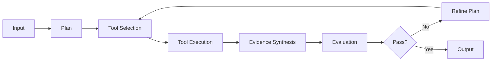

# FairSense-AgentiX

**An agentic fairness and AI-risk analysis platform developed by the [Vector Institute](https://vectorinstitute.ai/).**

---

## What is FairSense-AgentiX?

FairSense-AgentiX is an intelligent bias detection and risk assessment platform that uses **agentic AI workflows** to analyze text, images, and datasets for fairness concerns. Unlike traditional ML classifiers that operate as black boxes, FairSense employs a reasoning agent that:

- **Plans** its analysis strategy based on the input type
- **Selects** the right tools for each task (OCR, vision models, embeddings, knowledge retrieval)
- **Critiques** its own outputs and refines them iteratively
- **Explains** its reasoning process through detailed telemetry

This approach delivers more accurate, transparent, and context-aware fairness assessments than static rule-based systems.

---

## Key Features

### 🤖 Agentic Reasoning
Built on [LangGraph](https://langchain-ai.github.io/langgraph/), FairSense-AgentiX implements a **ReAct (Reasoning + Acting) loop** that:

- Dynamically selects analysis tools based on input characteristics
- Iteratively refines outputs using an evaluator-critique cycle
- Provides full transparency into decision-making via event streaming

### 🔍 Multi-Modal Analysis
Supports three analysis workflows:

- **Text Bias Detection** - Identifies gender, racial, age, disability, and socioeconomic biases in text
- **Image Bias Detection** - Analyzes visual content for stereotypes and representation issues using vision-language models
- **Risk Assessment** - Evaluates ML deployment scenarios for fairness, security, and compliance risks

### 🛠️ Flexible Tool Ecosystem
FairSense intelligently orchestrates a suite of specialized tools:

- **OCR Tools** (Tesseract, PaddleOCR) for text extraction
- **Vision-Language Models** (BLIP, BLIP-2) for image understanding
- **Embedding Models** for semantic search
- **FAISS Vector Databases** for knowledge retrieval
- **LLMs** (GPT-4, Claude) for reasoning and synthesis

### 🌐 Production-Ready APIs
- **FastAPI REST API** for programmatic access
- **WebSocket streaming** for real-time agent telemetry
- **React UI** with landing page, demo examples, and live timeline visualization
- **Batch processing** for large-scale analysis jobs

### ⚙️ Highly Configurable
Fine-tune every aspect of the system:

- Swap LLM providers (OpenAI, Anthropic, custom)
- Choose OCR/vision model backends
- Enable/disable refinement loops
- Customize evaluation thresholds
- Override tool selection strategies

---

## How It Works

FairSense implements a **multi-node agentic workflow**:



1. **Planning** - Agent analyzes input and creates an action plan
2. **Tool Selection** - Chooses appropriate tools (OCR, VLM, embeddings, etc.)
3. **Execution** - Runs selected tools in parallel when possible
4. **Synthesis** - Combines evidence from multiple sources
5. **Evaluation** - Critiques output quality (completeness, accuracy)
6. **Refinement** - Iteratively improves results based on critique (optional but recommended)

This **critique-driven refinement loop** distinguishes FairSense from static pipelines, enabling it to handle edge cases and improve output quality dynamically.

---

## Quick Start

### Installation

```bash
# Clone the repository
git clone https://github.com/VectorInstitute/fairsense-agentix.git
cd fairsense-agentix

# Install dependencies with uv
uv sync
source .venv/bin/activate

# Configure API keys (see Configuration section)
# Create .env file with your settings (see getting_started.md)
```

### Your First Analysis

```python
from fairsense_agentix import FairSense

# Initialize the engine
engine = FairSense()

# Analyze text for bias
result = engine.analyze_text(
    "We're looking for a young, energetic developer to join our startup team."
)

print(f"Overall: {result.summary}")
print(f"Found {len(result.bias_instances)} bias instances")
for instance in result.bias_instances:
    print(f"  - {instance['type']} ({instance['severity']}): {instance['text_span']}")
```

### Using the Web Interface

The easiest way to get started is with the integrated web interface:

```python
# Launch both backend and frontend
from fairsense_agentix import server
server.start()
```

Or use an example script:
```bash
python examples/launch_server.py
```

This starts:
- **Backend API** at `http://localhost:8000`
- **React UI** at `http://localhost:5173`

The UI has two pages:

- **Landing page** (`/`) — introduces the platform with a hero section, background gradient, and three analysis mode cards (Bias Text, Bias Image, Risk). Click any card to jump directly into that mode.
- **Analysis app** (`/analyze`) — select a mode from the tab bar, then paste text, upload an image, or describe an AI deployment scenario. Each mode includes **clickable demo examples** in the right column to pre-fill inputs instantly. Results show a live agent timeline on the left and structured output on the right.

Risk results link to the [MIT AI Risk Repository](https://airisk.mit.edu/) and display relevance scores (0–1) with category labels from the repository's Domain Taxonomy.

---

## Documentation

- **[Getting Started](getting_started.md)** - Installation, configuration, and first steps
- **[Config & Troubleshooting](config_troubleshooting.md)** - .env, environment variables, and troubleshooting
- **[User Guide](user_guide.md)** - Detailed usage examples for text, image, and risk analysis
- **[API Reference](api.md)** - Python API and REST API documentation
- **[Server Guide](server.md)** - Running the FastAPI backend and React UI
- **[Developer Guide](developers.md)** - Contributing and extending FairSense-AgentiX
- **[Acknowledgments](acknowledgments.md)** - Funding and institutional support

---

## Architecture

FairSense-AgentiX is built on a modern Python stack:

- **LangGraph** - Agentic workflow orchestration
- **LangChain** - LLM abstractions and tool integrations
- **FastAPI** - REST API and WebSocket server
- **React + Vite** - Modern web UI with TypeScript
- **Pydantic** - Type-safe configuration and data validation
- **FAISS** - Vector similarity search for knowledge retrieval

---

## Use Cases

FairSense-AgentiX is designed for:

- **Content Moderation** - Detect biased language in user-generated content
- **Hiring & HR** - Audit job postings for discriminatory language
- **Marketing** - Review ad copy for inclusive language
- **ML Model Audits** - Assess fairness risks before deployment
- **Policy Compliance** - Ensure content meets DEI standards
- **Research** - Study patterns of bias in large text/image corpora

---

## Acknowledgments

Resources used in preparing this research were provided, in part, by the Province of Ontario, the Government of Canada through CIFAR, and companies sponsoring the Vector Institute.

This research was funded by the European Union's Horizon Europe research and innovation programme under the AIXPERT project (Grant Agreement No. 101214389).

---

## License

FairSense-AgentiX is released under the [MIT License](https://github.com/VectorInstitute/fairsense-agentix/blob/main/LICENSE).

---

## Contributing

We welcome contributions! Please see our [Contributing Guide](https://github.com/VectorInstitute/fairsense-agentix/blob/main/CONTRIBUTING.md) for details on:

- Code style (PEP 8, numpy docstrings)
- Pre-commit hooks (ruff, mypy, pytest)
- Testing requirements
- Pull request process

---

## Support

- **GitHub Issues**: [Report bugs or request features](https://github.com/VectorInstitute/fairsense-agentix/issues)
- **Discussions**: [Ask questions or share ideas](https://github.com/VectorInstitute/fairsense-agentix/discussions)
- **Vector Institute**: [Learn more about our work](https://vectorinstitute.ai/)

---

**Built with :material-heart: by the Vector Institute AI Engineering team.**
